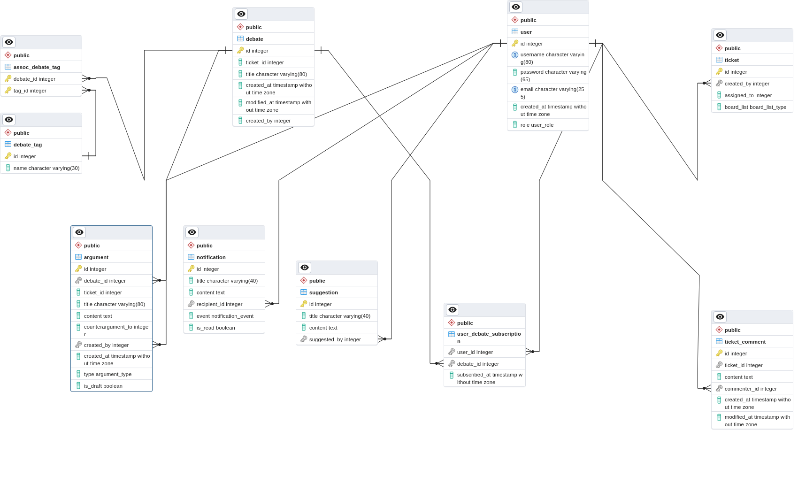

# Decent Debates

- [Decent Debates](#decent-debates)
  - [Setting up](#setting-up)
    - [The root `.env` file](#the-root-env-file)
    - [The `api` `.env` file](#the-api-env-file)
  - [Spinning up the application](#spinning-up-the-application)
  - [Working on the application](#working-on-the-application)
    - [Dealing with DB schema changes](#dealing-with-db-schema-changes)
    - [Seeding the database](#seeding-the-database)
  - [My Research](#my-research)
  - [UML](#uml)


## Setting up

### The root `.env` file

These variables are going to be used to configure the local Postgres instance.

```bash
# Ensure you're in the root folder.
cp .env.example .env
```

### The `api` `.env` file

Here the cookie secret should be provided.

```bash
# Ensure you're in the `api` directory.
cp .env.example .env
```

---

## Spinning up the application

1. Start the containers

    ```bash
    # Ensure you're in the root folder.
    docker-compose up
    ```

2. Start the Next.js application

    ```bash
    cd next
    npm run dev
    ```

    You can also run in debug mode by selecting the Next.js configuration before starting up the debugging process.

3. Start the Nest.js application

    ```bash
    # From the root folder.
    cd api

    npm run start:dev
    ```

    You can also run in debug mode by selecting the Nest.js configuration before starting up the debugging process.

---

## Working on the application

### Dealing with DB schema changes

Quickly _reload_ the Postgres instance with the new changes:

```bash
docker compose down -v && docker compose up
```

### Seeding the database

```bash
# Ensure you're in the `api` folder.
npx knex seed:run
```

---

## My Research

I came up with many questions while working on this project:

* [JWT vs Sessions](https://hollow-soccer-dbb.notion.site/JWT-vs-Sessions-10068cc24cb0490cbeb4a30a06297ed7)
* [Why I decided not to use an ORM](https://hollow-soccer-dbb.notion.site/Why-I-decided-not-to-use-an-ORM-08b79f90900648a4a702c63d0bee030d)
* [Should business logic be kept in the database layer(e.g. stored procedures) or in the business layer? ](https://hollow-soccer-dbb.notion.site/Should-business-logic-be-kept-in-the-database-layer-e-g-stored-procedures-or-in-the-business-layer-c333c61162d34dc986d40a6c7d7049c9)

## UML

