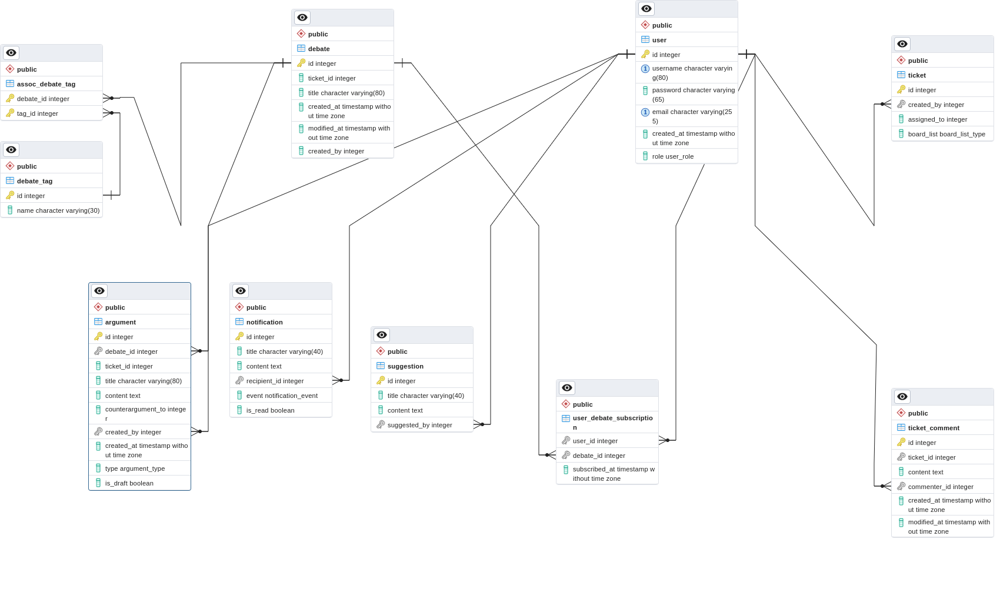

# Decent Debates

_More about this project, including the movations behind it and some demo pictures, can be found [here](https://andreigatej.dev/projects/decentdebates/)._

- [Decent Debates](#decent-debates)
  - [Setting up](#setting-up)
    - [The DB `.env` file](#the-db-env-file)
    - [The `api` `.env` file](#the-api-env-file)
  - [Spinning up the application](#spinning-up-the-application)
  - [Working on the application](#working-on-the-application)
    - [Dealing with DB schema changes](#dealing-with-db-schema-changes)
    - [Seeding the database](#seeding-the-database)
  - [My Research](#my-research)
  - [UML](#uml)


## Setting up

### Prerequisites

* `pnpm`
* `docker`

### The DB `.env` file

These variables are going to be used to configure the local Postgres instance.

```bash
# Ensure you're in the `packages/db` folder.
cp .env.example .env
```

### The `api` `.env` file

Here, the cookie secret should be provided.

```bash
# Ensure you're in the `apps/api` directory.
cp .env.example .env
```

For backend test-specific overrides, you can also create `apps/api/.env.test` from `apps/api/.env.test.example`.

---

## Spinning up the application

1. Install dependencies

    ```bash
    pnpm install
    ```

2. Start everything

    ```bash
    pnpm run dev
    ```

    This invokes `docker compose`, builds shared packages, and then starts the client and API dev servers.

3. To inspect the service logs:

    ```bash
    pnpm run db:logs
    ```

---

## Developing

### Dealing with DB schema changes

Quickly _reload_ the Postgres instance with the new changes:

```bash
pnpm run db:reset
```

### Seeding the database

```bash
# Ensure you're in the root folder.
# Note: you can invoke this while `pnpm run dev` is running.
pnpm run seed
```

To run one specific seed file:

```bash
pnpm run seed:file -- 03_debates.js
```

---

## My Research

I came up with many questions while working on this project:

* [JWT vs Sessions](https://hollow-soccer-dbb.notion.site/JWT-vs-Sessions-10068cc24cb0490cbeb4a30a06297ed7)
* [Why I decided not to use an ORM](https://hollow-soccer-dbb.notion.site/Why-I-decided-not-to-use-an-ORM-08b79f90900648a4a702c63d0bee030d)
* [Should business logic be kept in the database layer(e.g. stored procedures) or in the business layer? ](https://hollow-soccer-dbb.notion.site/Should-business-logic-be-kept-in-the-database-layer-e-g-stored-procedures-or-in-the-business-layer-c333c61162d34dc986d40a6c7d7049c9)

## UML


