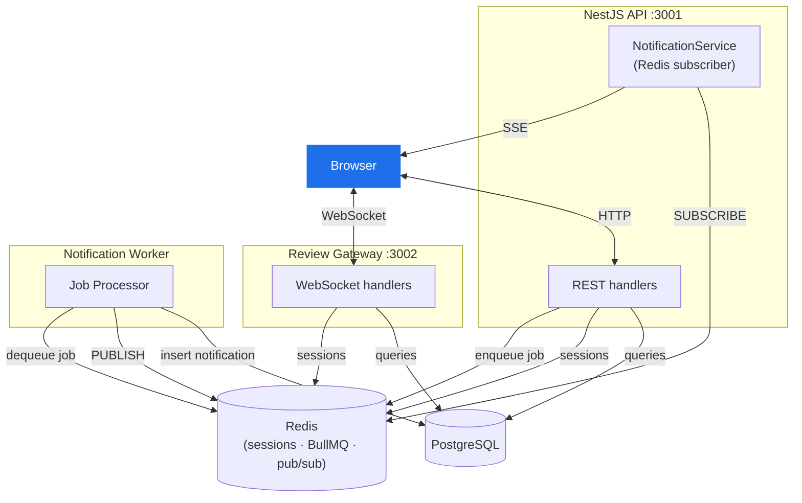
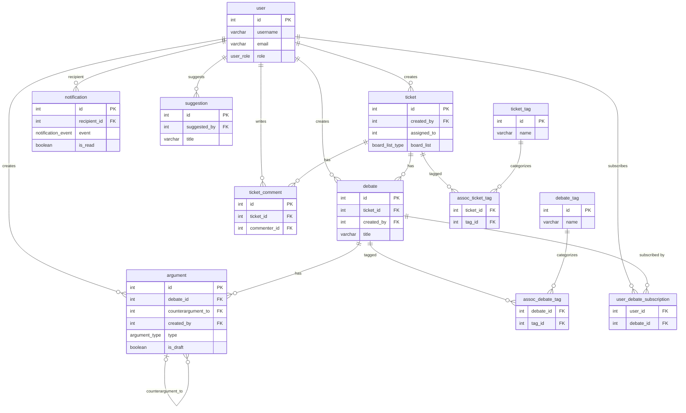

# Decent Debates

A full-stack platform for structured, moderated debates. Users submit debates and arguments for or against a position; moderators review submissions, communicate with authors in real time, and manage the queue through a live Kanban board. The goal is to keep discussions grounded and productive.

> More context, motivations, and demo screenshots: [andreigatej.dev/projects/decentdebates](https://andreigatej.dev/projects/decentdebates/)

---

## Table of Contents

- [Tech Stack](#tech-stack)
- [Architecture](#architecture)
- [Key Design Decisions](#key-design-decisions)
- [Testing](#testing)
- [Database Schema](#database-schema)
- [Local setup](docs/local-setup.md)

---

## Tech Stack

| Layer | Technologies |
|---|---|
| **Frontend** | Next.js (SSR + React Server Components), React, TypeScript |
| **Backend** | Node.js, NestJS, REST API, BullMQ (async job queue) |
| **Database** | PostgreSQL, Redis |
| **Real-time** | WebSockets (Socket.io), Server-Sent Events |
| **Auth** | Session-based (express-session + Redis), Role-Based Access Control (RBAC) |
| **Testing** | Playwright (E2E), Jest (API unit + integration), Vitest (client unit) |
| **Infra** | Docker, Docker Compose, GitHub Actions (CI/CD) |
| **Monorepo** | Turborepo, pnpm |

---

## Architecture

The project is a **pnpm + Turborepo monorepo** with four main packages:

- **`apps/client`** — Next.js frontend. SSR is used for debate pages; real-time UI (Kanban, chat) is client-side.
- **`apps/api`** — NestJS REST API. Handles authentication, debate logic, and manages persistent real-time connections.
- **`apps/notification-worker`** — Headless NestJS worker. Consumes notification jobs from the BullMQ queue, writes to the DB, and publishes delivery signals via Redis pub/sub.
- **`packages/db`** — PostgreSQL schema, migrations, and seed scripts.

At a high level:

- The REST API handles core business logic and persistence. When a domain action produces a notification (ticket created, argument approved, review comment added), it enqueues a BullMQ job instead of writing synchronously — keeping the request path fast and the notification delivery durable.
- The notification worker runs as a separate process, consuming jobs from the queue, inserting notification rows, and publishing a Redis pub/sub message so connected SSE clients are pushed an update in real time.
- Redis serves three roles: session store, BullMQ job queue, and pub/sub delivery bus.
- The Review gateway handles bidirectional moderation flows (comments, argument edits) over WebSockets.
- SSE handles lightweight user notifications (unidirectional).

```mermaid
graph TB
    Browser

    subgraph NEST ["NestJS API :3001"]
        API["REST handlers"]
        NS["NotificationService\n(Redis subscriber)"]
    end

    subgraph GWS ["Review Gateway :3002"]
        GW["WebSocket handlers"]
    end

    subgraph WORKER ["Notification Worker"]
        NW["Job Processor"]
    end

    Redis[("Redis\n(sessions · BullMQ · pub/sub)")]
    PG[("PostgreSQL")]

    Browser <-->|HTTP| API
    Browser <-->|WebSocket| GW
    NS -->|SSE| Browser

    API -->|enqueue job| Redis
    API -->|sessions| Redis
    API -->|queries| PG

    GW -->|sessions| Redis
    GW -->|queries| PG

    NW -->|dequeue job| Redis
    NW -->|PUBLISH| Redis
    NW -->|insert notification| PG

    NS -->|SUBSCRIBE| Redis

    style Browser fill:#1f6feb,color:#fff,stroke:#1f6feb
```

---

## Key Design Decisions

### Session-based auth over JWTs

Sessions are stored in Redis via `connect-redis`. A global `AuthenticateGuard` checks `req.session.user` on every request; routes that must be public opt out with `@Public()`.

JWTs are often presented as stateless, but secure implementations pair short-lived access tokens with refresh tokens, and those refresh tokens need to be stored and revocable server-side. That makes the server stateful, which is essentially the same overhead as sessions but with more moving parts. Sessions with Redis keep the approach simple.

### No ORM

All database access goes through raw `pg` queries. The reasons:
- full control over the query
- avoid subtle and unexpected bugs
- better understanding of what the database is actually doing

The schema lives in a single `schema.sql`. Knex is used only for its seed-script runner.

### CI: fail-fast strategy

Lint, format, and tests (unit and integration) all run at the start of the pipeline and in parallel (Turborepo helps here). The build job is deliberately left last: if anything earlier fails, there's no point running a full build. This keeps feedback loops short and the CI queue from filling up with slow, ultimately pointless build runs.

### Async notification delivery via BullMQ

Notifications are decoupled from the HTTP request path. When a domain action occurs (ticket created, argument approved, review comment added), the API enqueues a BullMQ job and returns immediately — it does not write to the `notification` table directly.

A separate headless process (`apps/notification-worker`) consumes the queue, performs the DB insert, and publishes a Redis pub/sub message that triggers the SSE push to connected clients.

The key properties this buys:

- **Durability** — jobs are persisted in Redis. If the API crashes after enqueuing but before the worker processes the job, the notification is not lost.
- **Retry** — failed DB writes are retried automatically with configurable backoff, without any action from the caller.
- **Request path isolation** — a slow or failing notification side effect cannot delay or break the HTTP response.

### Error and failure handling

**HTTP layer**
- Global `ValidationPipe` (whitelist mode) strips unknown fields and rejects malformed DTOs before they reach a handler.
- `AuthenticateGuard` (registered as `APP_GUARD`) throws `UnauthorizedException` on missing or invalid sessions.
- `RolesGuard` returns 403 when the user's role doesn't satisfy `@Roles(...)` on a handler.

**WebSocket layer**
- Connection failures: the socket receives an `error` event and is disconnected.
- Message handler failures: the sender is removed from the review room and receives an `error` event; other participants are not affected.

---

## Testing

| Tier | Tool | What's covered |
|---|---|---|
| Unit | Jest (API), Vitest (client) | Input validation pipes, pure transformation logic |
| Integration | Jest + real Postgres + Redis | Service layer, DB queries, auth flows end-to-end |
| E2E | Playwright | Full user journeys (auth, debate submission, review flow) |

On the backend, integration tests are the primary focus: they bootstrap the full NestJS app, apply `schema.sql` from scratch, and test actual isolated flows without stubbing — catching schema/query issues that unit tests can't surface.

---

## Database Schema

The schema covers users, debates, arguments, moderation states, and chat messages. Key patterns used:

- **CTEs** for readable, multi-step read queries (e.g. fetching a debate with its arguments and moderation status in one round trip)
- **Transactions** for operations that must be atomic (e.g. submitting an argument and creating its initial moderation record)

```mermaid
%%{init: {'er': {'layoutDirection': 'LR', 'minEntityWidth': 160, 'entityPadding': 14}}}%%
erDiagram
    user {
        int id PK
        varchar username
        varchar email
        user_role role
    }
    ticket {
        int id PK
        int created_by FK
        int assigned_to
        board_list_type board_list
    }
    debate {
        int id PK
        int ticket_id FK
        int created_by FK
        varchar title
    }
    argument {
        int id PK
        int debate_id FK
        int counterargument_to FK
        int created_by FK
        argument_type type
        boolean is_draft
    }
    notification {
        int id PK
        int recipient_id FK
        notification_event event
        boolean is_read
    }
    suggestion {
        int id PK
        int suggested_by FK
        varchar title
    }
    ticket_comment {
        int id PK
        int ticket_id FK
        int commenter_id FK
    }
    ticket_tag {
        int id PK
        varchar name
    }
    debate_tag {
        int id PK
        varchar name
    }
    assoc_ticket_tag {
        int ticket_id FK
        int tag_id FK
    }
    assoc_debate_tag {
        int debate_id FK
        int tag_id FK
    }
    user_debate_subscription {
        int user_id FK
        int debate_id FK
    }

    user ||--o{ notification : "recipient"
    user ||--o{ suggestion : "suggests"
    user ||--o{ ticket : "creates"
    user ||--o{ debate : "creates"
    user ||--o{ argument : "creates"
    user ||--o{ ticket_comment : "writes"
    user ||--o{ user_debate_subscription : "subscribes"
    ticket ||--o{ debate : "has"
    ticket ||--o{ ticket_comment : "has"
    ticket ||--o{ assoc_ticket_tag : "tagged"
    debate ||--o{ argument : "has"
    debate ||--o{ user_debate_subscription : "subscribed by"
    debate ||--o{ assoc_debate_tag : "tagged"
    argument |o--o{ argument : "counterargument_to"
    ticket_tag ||--o{ assoc_ticket_tag : "categorizes"
    debate_tag ||--o{ assoc_debate_tag : "categorizes"
```

---

## Local setup

See [docs/local-setup.md](docs/local-setup.md).
